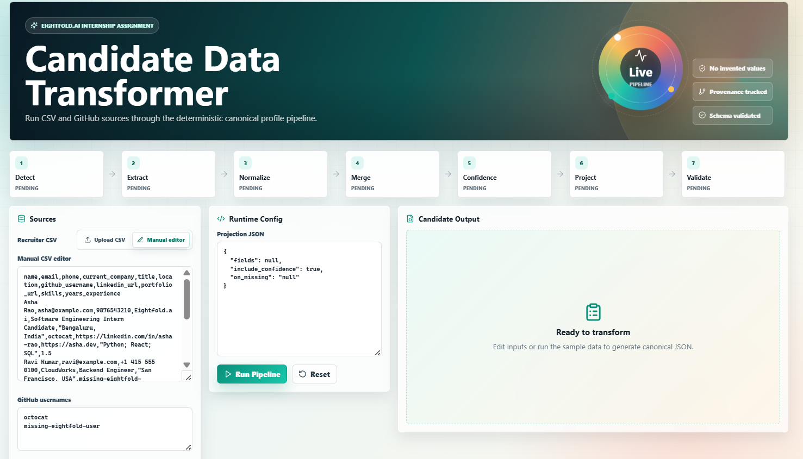
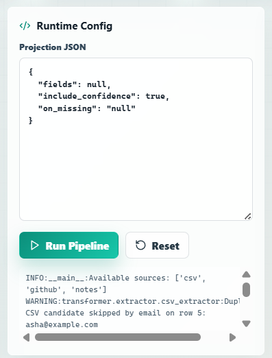
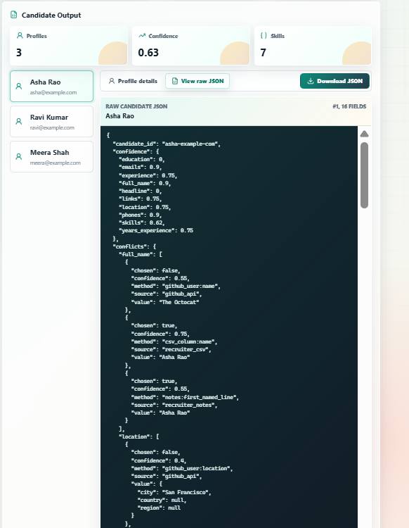

# Multi-Source Candidate Data Transformer

> **Eightfold Engineering Internship Assignment (July – December 2026)**

<p align="center">



</p>

<p align="center">

Transform messy candidate information from multiple sources into a single trusted JSON profile.

</p>

<p align="center">


</p>

---

## 📖 Overview

Recruiters often receive candidate information from multiple platforms such as recruiter spreadsheets, GitHub profiles, recruiter notes, and internal systems. These sources usually contain duplicate records, inconsistent formats, conflicting values, and incomplete information.

This project builds a **data transformation pipeline** that combines these scattered inputs into **one canonical candidate profile** while preserving:

- ✅ Data provenance
- ✅ Confidence scores
- ✅ Canonical skill names
- ✅ Normalized contact information
- ✅ Runtime configurable output schema

The project includes a **Python transformation engine** and a **React web interface**, allowing users to upload candidate data, execute the transformation pipeline, inspect results, and download the generated JSON profiles.

---

## 🎥 Demo

## 🎥 Demo Video

[](https://youtu.be/5j4m-YFvsD4)

> **Click the thumbnail above to watch the complete demo on YouTube.**

## 📸 Project Preview

### Home Page


### Runtime Configuration



### Raw JSON Output



---

# 📑 Table of Contents

- [Overview](#-overview)
- [Features](#-features)
- [System Architecture](#-system-architecture)
- [Pipeline Workflow](#-pipeline-workflow)
- [Normalization Strategy](#-normalization-strategy)
- [Merge & Conflict Resolution](#-merge--conflict-resolution)
- [Runtime Configuration](#-runtime-configuration)
- [User Interface](#-user-interface)
- [Project Structure](#-project-structure)
- [Technology Stack](#-technology-stack)
- [Getting Started](#-getting-started)
- [Running the Pipeline](#-running-the-pipeline)
- [Running the Web UI](#-running-the-web-ui)
- [Running Tests](#-running-tests)
- [Sample Output](#-sample-output)
- [Design Decisions](#-design-decisions)
- [Assumptions & Edge Cases](#-assumptions--edge-cases)
- [Demo Video](#-demo-video)


---

# ✨ Features

## 📂 Multi-Source Data Ingestion

Supports both structured and unstructured candidate information.

### Structured Source

- Recruiter CSV Export

### Unstructured Sources

- GitHub Usernames
- Recruiter Notes

---

## 🔄 Automatic Data Normalization

The transformer automatically standardizes:

- Phone Numbers (E.164)
- Country Names (ISO Standard)
- GitHub Usernames
- Dates
- Skill Names
- Email Formatting

Example

| Input | Normalized |
|--------|------------|
| ML | Machine Learning |
| machinelearning | Machine Learning |
| ReactJS | React |
| sklearn | Scikit-learn |

---

## 👤 Candidate Deduplication

The pipeline detects duplicate candidates using:

- Email Address
- Phone Number
- GitHub Username
- Name Similarity

Multiple records belonging to the same candidate are merged into a single trusted profile.

---

## 📊 Confidence Scoring

Every field in the final candidate profile receives a confidence score based on the reliability of its source.

Example priority:

```
Recruiter CSV
      │
      ▼
GitHub Profile
      │
      ▼
Recruiter Notes
```

The confidence score helps explain **why one value was selected over another**.

---

## 📌 Provenance Tracking

Every selected field stores its origin.

Example:

```json
{
    "field": "phone",
    "source": "Recruiter CSV",
    "method": "Normalized"
}
```

This makes the transformation pipeline completely transparent and explainable.

---

## ⚙ Runtime Configurable Output

Without changing any Python code, users can:

- Rename fields
- Remove fields
- Include only selected fields
- Enable or disable confidence scores
- Configure missing-value behavior

---

## 💻 Interactive Web Interface

The React application allows users to:

- Upload recruiter CSV
- Edit candidate data manually
- Add GitHub usernames
- Add recruiter notes
- Run the transformation pipeline
- View candidate profiles
- Inspect raw JSON
- Download generated JSON

---

# 🏗 System Architecture

```
                    Recruiter CSV
                          │
                          │
              GitHub Usernames
                          │
                          │
               Recruiter Notes
                          │
                          ▼
               Python Transformer
                          │
      ┌───────────────────┼───────────────────┐
      │                   │                   │
 Normalize           Merge Records      Confidence
      │                   │                   │
      └───────────────────┼───────────────────┘
                          │
                 Runtime Configuration
                          │
                    Output Validation
                          │
                          ▼
               Canonical Candidate JSON
                          │
                    React Frontend
```

The business logic is implemented entirely in Python, while the React frontend acts as a lightweight interface for providing inputs and viewing results.

---

# 🔄 Pipeline Workflow

```
Detect Sources
       │
       ▼
Extract Data
       │
       ▼
Normalize Values
       │
       ▼
Merge Candidates
       │
       ▼
Resolve Conflicts
       │
       ▼
Calculate Confidence
       │
       ▼
Apply Runtime Configuration
       │
       ▼
Validate Output
       │
       ▼
Generate JSON
```

### Step 1 — Detect

Checks which input sources are available.

Supported inputs include:

- Recruiter CSV
- GitHub Usernames
- Recruiter Notes

---

### Step 2 — Extract

Reads data from every source and converts it into a common internal representation.

---

### Step 3 — Normalize

Standardizes data into consistent formats.

Examples include:

- Phone numbers → E.164
- Countries → ISO Standard
- Emails → Lowercase
- GitHub usernames → Clean username
- Skills → Canonical skill names

---

### Step 4 — Merge

If multiple records belong to the same candidate, they are combined into a single profile.

---

### Step 5 — Confidence

Assigns confidence scores to every field based on the trustworthiness of its source.

---

### Step 6 — Runtime Configuration

Projects the internal candidate profile into a customizable output schema.

---

### Step 7 — Validation

Validates the final JSON before writing the output.

This ensures the generated profile satisfies the required schema while gracefully handling missing or malformed data.
---

# 📂 Project Structure

The project is organized into two main components:

- **Transformer** – Python-based data processing pipeline
- **UI** – React application for interacting with the pipeline

```text
Eightfold/
│
├── README.md
├── requirements.txt
│
├── transformer/
│   ├── main.py
│   ├── config.json
│   ├── custom_config.json
│   │
│   ├── extractor/
│   ├── normalizer/
│   ├── merger/
│   ├── projector/
│   ├── validator/
│   │
│   ├── sample_inputs/
│   │     ├── candidates.csv
│   │     ├── github_usernames.txt
│   │     └── recruiter_notes.txt
│   │
│   ├── output/
│   │
│   └── tests/
│
├── ui/
│   ├── src/
│   ├── public/
│   ├── package.json
│   └── server.js
│
└── images/
      ├── homepage.png
      ├── profile.png
      └── json.png
```

---

# 🛠 Technology Stack

| Category | Technology |
|-----------|------------|
| Programming Language | Python 3 |
| Frontend | React + Vite |
| Backend API | Express.js |
| API Integration | GitHub Public API |
| HTTP Client | requests |
| Phone Normalization | phonenumbers |
| Country Standardization | pycountry |
| Testing | Python unittest |

---

# 🚀 Getting Started

Follow these steps to run the project on your local machine.

---

## 1️⃣ Clone the Repository

```bash
git clone https://github.com/your-username/Multi-Source-Candidate-Transformer.git

cd Multi-Source-Candidate-Transformer
```

---

## 2️⃣ Install Python Dependencies

Install all required Python packages.

```bash
pip install -r requirements.txt
```

---

## 3️⃣ Install Frontend Dependencies

Navigate to the UI folder.

```bash
cd ui

npm install

cd ..
```

---

# ▶ Running the Candidate Transformer (CLI)

The command-line interface executes the complete transformation pipeline.

### Default Output

```bash
python -m transformer.main \
--csv transformer/sample_inputs/candidates.csv \
--github-usernames transformer/sample_inputs/github_usernames.txt \
--notes transformer/sample_inputs/recruiter_notes.txt \
--config transformer/config.json \
--output transformer/output/default_output.json
```

Generated Output

```text
transformer/output/default_output.json
```

---

## Generate Custom Output

The transformer also supports runtime configurable output.

```bash
python -m transformer.main \
--csv transformer/sample_inputs/candidates.csv \
--github-usernames transformer/sample_inputs/github_usernames.txt \
--notes transformer/sample_inputs/recruiter_notes.txt \
--config transformer/custom_config.json \
--output transformer/output/custom_output.json
```

Generated Output

```text
transformer/output/custom_output.json
```

---

# 🌐 Running the Web Application

The React frontend provides a simple interface for executing the pipeline without using the command line.

Navigate to the UI folder.

```bash
cd ui
```

Start the development server.

```bash
npm run dev
```

Open your browser and visit

```
http://localhost:5173
```

> If port **5173** is already in use, Vite automatically selects another available port. Open the URL displayed in the terminal.

---

# 📖 Using the Application

The application is designed to execute the complete pipeline in just a few steps.

---

## Step 1 — Open the Application

Launch the React application in your browser.

You will see the Candidate Transformer dashboard.

---

## Step 2 — Upload Candidate Data

Choose one of the following options:

- Upload a Recruiter CSV file
- Edit the default CSV manually

---

## Step 3 — Add GitHub Usernames

Supported formats include:

```
octocat

@octocat

https://github.com/octocat
```

The transformer automatically extracts the username.

---

## Step 4 — Add Recruiter Notes

Example

```
John Doe is based in Bengaluru.

Strong in React and Kubernetes.

Available from next month.
```

Recruiter notes are parsed conservatively to extract useful candidate information.

---

## Step 5 — Review Runtime Configuration

The runtime configuration determines how the final JSON is generated.

You can:

- Rename fields
- Remove fields
- Select only required fields
- Enable or disable confidence scores
- Configure missing-value behavior

---

## Step 6 — Run the Pipeline

Click

```
Run Pipeline
```

The application will execute the following stages:

```
Extract
↓

Normalize
↓

Merge

↓

Calculate Confidence

↓

Project

↓

Validate

↓

Generate JSON
```

---

## Step 7 — View Results

The generated candidate profile can be viewed in two formats.

### Profile View

Displays candidate information in a structured layout.

Includes:

- Candidate Details
- Contact Information
- Skills
- Experience
- Education
- Confidence Score
- Provenance

---

### Raw JSON View

Displays the complete generated JSON exactly as produced by the transformer.

Useful for debugging and verification.

---

## Step 8 — Download Output

Click

```
Download JSON
```

to save the selected candidate profile.

---

# 📦 Output Files

After running the transformer, the following files are generated.

Default output

```text
transformer/output/default_output.json
```

Custom output

```text
transformer/output/custom_output.json
```

Temporary UI files

```text
transformer/output/ui_runtime/
```

---

# 📷 User Interface

## Dashboard

> Replace with your screenshot.

```markdown

```

---

## Candidate Profile

```markdown

```

---

## Raw JSON Output

```markdown

```
---

# ⚙ Runtime Configuration

The transformer supports **runtime configurable output**, allowing the JSON schema to be customized without modifying the Python source code.

This makes the pipeline flexible and reusable for different downstream systems.

## Default Configuration

```json
{
  "fields": null,
  "include_confidence": true,
  "on_missing": "null"
}
```

## Example Custom Configuration

```json
{
  "fields": [
    {
      "path": "name",
      "from": "full_name",
      "type": "string"
    },
    {
      "path": "email",
      "from": "emails[0]",
      "type": "string"
    },
    {
      "path": "skills",
      "from": "skills[].name",
      "type": "string[]"
    }
  ],
  "include_confidence": false,
  "on_missing": "omit"
}
```

### Supported Missing Value Policies

| Option | Description |
|---------|-------------|
| `null` | Missing fields are returned as `null`. |
| `omit` | Missing fields are removed from the output. |
| `error` | Stops execution if a required field is missing. |

---

# 🔄 Data Normalization Strategy

Candidate information often comes in inconsistent formats.

The normalization stage converts all values into a common canonical representation before merging.

## Phone Numbers

All phone numbers are converted to the international **E.164** format.

Example

| Input | Output |
|--------|--------|
| 9876543210 | +919876543210 |

---

## Country Names

Country names are standardized using **ISO country names**.

| Input | Output |
|--------|--------|
| India | India |
| IND | India |
| Bharat | India |

---

## GitHub Usernames

The transformer accepts multiple GitHub formats.

| Input | Output |
|--------|--------|
| octocat | octocat |
| @octocat | octocat |
| https://github.com/octocat | octocat |

---

## Skill Canonicalization

Common aliases and spelling variations are converted into a standard skill name.

| Input | Canonical Skill |
|--------|-----------------|
| ML | Machine Learning |
| machinelearning | Machine Learning |
| ReactJS | React |
| react.js | React |
| sklearn | Scikit-learn |
| K8S | Kubernetes |

This prevents duplicate skills from appearing in the final profile.

---

## Email Standardization

Email addresses are normalized before duplicate detection.

Example

```
JohnDoe@GMAIL.COM
```

↓

```
johndoe@gmail.com
```

---

# 🤝 Candidate Merge Strategy

The same candidate may appear across multiple input sources.

Instead of creating duplicate profiles, the transformer intelligently combines matching records.

Duplicate detection uses the following identifiers:

- Email Address
- Phone Number
- GitHub Username
- Name Similarity

Once a match is found, candidate information is merged into a single canonical profile.

---

# ⚖ Conflict Resolution

Conflicting values are resolved using source reliability.

Priority order:

```
Recruiter CSV
        │
        ▼
GitHub Profile
        │
        ▼
Recruiter Notes
```

Example

| Source | Phone Number |
|----------|-------------|
| Recruiter CSV | +91XXXXXXXXXX |
| Recruiter Notes | 9876543210 |

The normalized CSV value is selected because it has a higher confidence.

---

# 📊 Confidence Scoring

Every selected field includes a confidence score that represents the reliability of the chosen value.

Example

```json
{
  "phone": "+919876543210",
  "confidence": 0.97
}
```

Confidence scores help downstream applications understand why a particular value was selected.

---

# 📍 Provenance Tracking

Every field also stores information about its origin.

Example

```json
{
  "phone": {
    "value": "+919876543210",
    "source": "Recruiter CSV",
    "confidence": 0.97
  }
}
```

This improves transparency and makes the pipeline easier to audit.

---

# 📄 Sample Output

A generated candidate profile contains the following information.

```json
{
  "full_name": "John Doe",
  "emails": [
    "john@example.com"
  ],
  "phones": [
    "+919876543210"
  ],
  "country": "India",
  "skills": [
    "Python",
    "Machine Learning",
    "React"
  ],
  "github": "johndoe",
  "overall_confidence": 0.95
}
```

---

# 🧪 Running Tests

The project includes automated unit tests for the core transformation pipeline.

Run all tests using:

```bash
python -m unittest discover -s transformer/tests
```

Expected output

```text
Ran 19 tests

OK
```

The test suite validates:

- Data normalization
- Candidate merging
- GitHub username parsing
- Recruiter notes parsing
- Runtime configuration
- JSON projection
- Configuration validation

---

# 💡 Design Decisions

Several design decisions were made to improve maintainability, scalability, and transparency.

### Modular Pipeline

Each transformation stage is implemented independently.

```
Extract
↓

Normalize

↓

Merge

↓

Confidence

↓

Project

↓

Validate
```

This allows individual stages to be tested and extended without affecting the rest of the pipeline.

---

### Canonical Internal Schema

All input sources are first converted into a common internal representation.

Benefits:

- Simplifies merging
- Reduces duplicate logic
- Makes new data sources easier to integrate

---

### Conservative Note Parsing

Recruiter notes are intentionally parsed conservatively.

Only well-defined patterns are extracted to avoid generating incorrect information.

---

### Runtime Configuration

Instead of hardcoding the output schema, projection is driven entirely by configuration files.

This allows different teams to generate customized JSON without modifying the application.

---

### Thin Frontend

The React application focuses only on user interaction.

All business logic resides in the Python transformer, ensuring a clear separation of responsibilities.
---

# 🚧 Assumptions & Edge Cases

The transformer is designed to be robust while avoiding incorrect data generation.

### Assumptions

- Unknown values are never invented.
- Candidate profiles are merged only when sufficient matching information exists.
- Recruiter notes are parsed conservatively using predefined patterns.
- The GitHub API returns only publicly available information.
- Runtime configuration is validated before output generation.

---

### Edge Cases Handled

- Missing CSV values
- Empty recruiter notes
- Invalid phone numbers
- Duplicate candidates
- Multiple GitHub username formats
- Skill aliases and common typos
- Missing optional input files
- Invalid runtime configuration
- GitHub API rate limiting

The pipeline continues gracefully whenever possible and reports validation errors when required.


# 📸 Screenshots

## Home Dashboard


```markdown

```

---

## Candidate Profile

```markdown

```

---

## Raw JSON Output

```markdown

```

---

# 🎬 Demo Video

A short demonstration of the project is available below.

**The demo includes:**

- Project overview
- Running the Python transformer
- Running unit tests
- Launching the React application
- Uploading candidate data
- Executing the pipeline
- Viewing candidate profiles
- Viewing raw JSON output
- Downloading generated JSON

> **Demo Link**

```
https://youtu.be/5j4m-YFvsD4?si=PS5xt768pww3VlUx
```

---

# 🎯 Why This Project?

Recruiting systems often receive candidate information from multiple disconnected sources.

This project demonstrates how a modular data transformation pipeline can:

- Consolidate structured and unstructured data
- Normalize inconsistent information
- Merge duplicate candidate records
- Resolve conflicting values
- Track provenance
- Assign confidence scores
- Produce configurable JSON output

The project emphasizes **clean architecture**, **maintainability**, and **extensibility**, making it suitable for real-world data engineering and backend workflows.

---

# 📚 Key Learnings

Building this project provided experience in:

- Designing modular data pipelines
- Data normalization techniques
- Record deduplication strategies
- Conflict resolution
- Confidence scoring
- Runtime schema projection
- Configuration-driven development
- REST API integration
- React and Python integration
- Unit testing and validation

---
